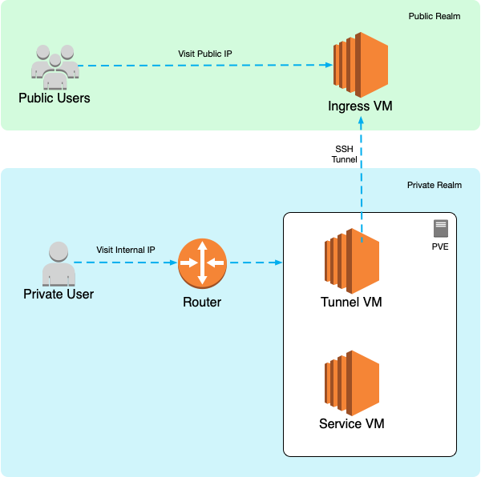

# minilab

My minilab infrastructure

## Background

As of early 2021, I am primarily working from home with the occasional need to travel to the office. While a local LAN environment could suffice most of the time, I still require public internet exposure for some of the services. For instance, demoing work to my collegues, or setting up a webhook for a CI pipeline. 

However, my ISP will not provide me with a public IP address. And to make the problem more complicated, their implementation is basically a NAT of households which is not routable from the outside, so DDNS is out of question. 

While there are plenty of services like [ngrok](https://ngrok.com) out there providing tunneling, I felt like gaining more control of my own stack by rolling a solution myself, hence this repo.

## Overview

Minilab primarily consists of three components:

1. An ingress VM hosted in the cloud with a public IP address.
2. One or more servers equipped with [Proxmox Virtualization Environment](https://www.proxmox.com/en/proxmox-ve).
3. A mini edge router to ensure stable IP address allocation in different network environment (i.e. Office, Coffee Shop).



In the private realm, the router routes internal traffic to VMs hosted by the PVE server. This normally suffices the daily needs when working at home or in the office.

However, from time to time, public access to the internal services are required. For instance, setting up a CI pipeline often requires a publicly accessible webhook address, or I suddenly decide to work from a coffee stand without taking the server stack with me. Under these circumstances, the public realm comes into play.


In the public realm, the cloud ingress VM accepts traffic from the public internet through its public IP address. It connects with the private realm via an active SSH tunnel controlled by a tunnel VM in the private realm. The ingress VM then acts as a reverse proxy which redirects incoming requests to local SSH tunnel ports.

## Hardware

Currently, the minilab uses the following hardware:

1. <b>1</b> x VM hosted by [Alicloud](https://aliyun.com) for ingress.
2. <b>1</b> x Xeon E-2286M / 64G / 1TB mini server for PVE.
3. <b>1</b> x Mikrotik RB941-2nD-TC for router.

## Software

Unless otherwise specified, the following software and their respecitve versions are used:
- Proxmox Virtual Environment 6.3
- Ubuntu 18.04 LTS
- [Terraform](https://terraform.io) v0.13.1
- [Terraform Provider Proxmox](https://github.com/Telmate/terraform-provider-proxmox) v2.6.7

## Setup

Although it is desired to automate the setup process as much as possible. There are always aspects of the stack that is not cost effective to build automatically. The following tasks may need to be performed manually beforehand.

### Pre

<h4>Ingress VM</h4>

- [x] Ensure the VM purchased from the cloud provider has a public IP address.
- [x] Configure its security group to restrict access to the (non-static)
public IP address allocated by the ISP, for more security.
- [x] (Optionally) Point the desired domain name to the ingress VM.
- [x] `apt-get install -y python3`

<h4>PVE</h4>

- [x] Install [Proxmox Virtualization Environment](https://www.proxmox.com/en/proxmox-ve) on the internal server.
- [x] Download the Ubuntu LXC template.
- [x] Download the [Ubuntu Cloud Image](https://cloud-images.ubuntu.com/bionic/) and follow [this guide](https://gist.github.com/KrustyHack/fa39e509b5736703fb4a3d664157323f) to convert it to a VM template.

<h4>Router</h4>

- [x] Configure the DHCP range of the router to `X.X.X.240 - X.X.X.254` so we can allocate the IPs before it statically.

### Provision

### Configuration

```
# fill out these two files
cp hosts.example.ini hosts.ini
cp values.example.yml values.yml

# add -l to further limit hosts
# add -t to further select tasks by tags
ANSIBLE_HASH_BEHAVIOUR=merge ansible-playbook playbook.yml -i hosts.ini -e @values.yml
```

### Post